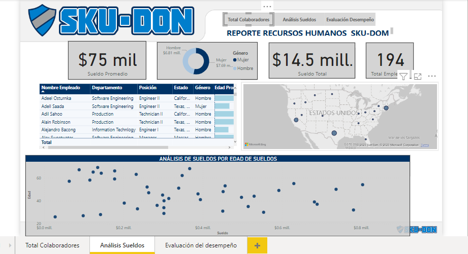
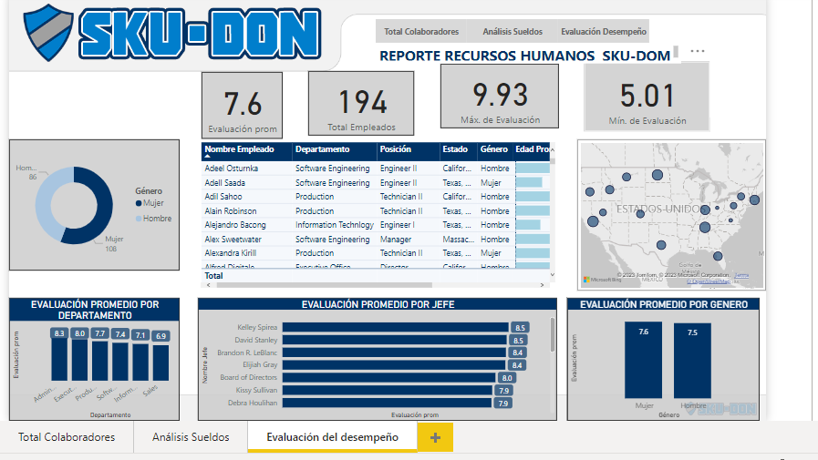
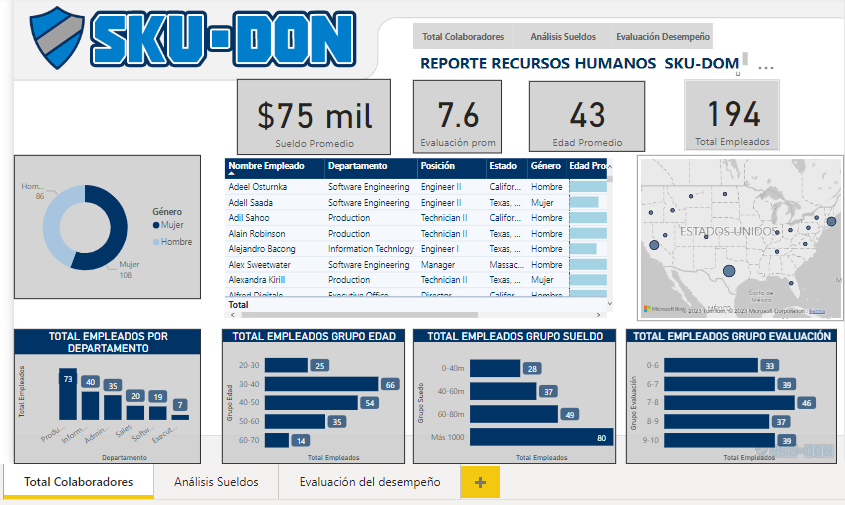
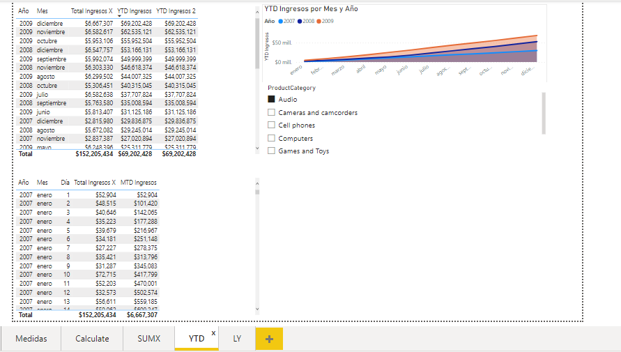
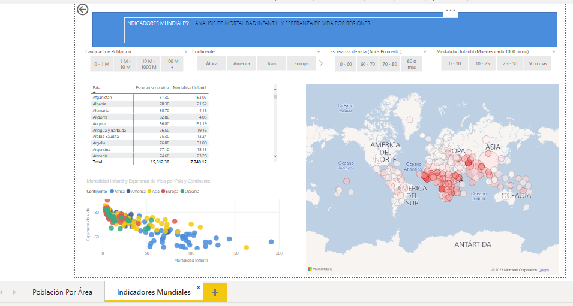
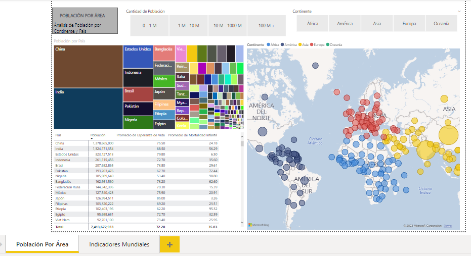

# ProyectosPowerBI
Portafolio de proyectos en PowerBI

Reporte Recursos Humanos .Analisis de sueldo: sueldo promedio , analisis de sueldo por edades

Analisis Evaluacion de desempeño

Analisis Total de colaboradores

